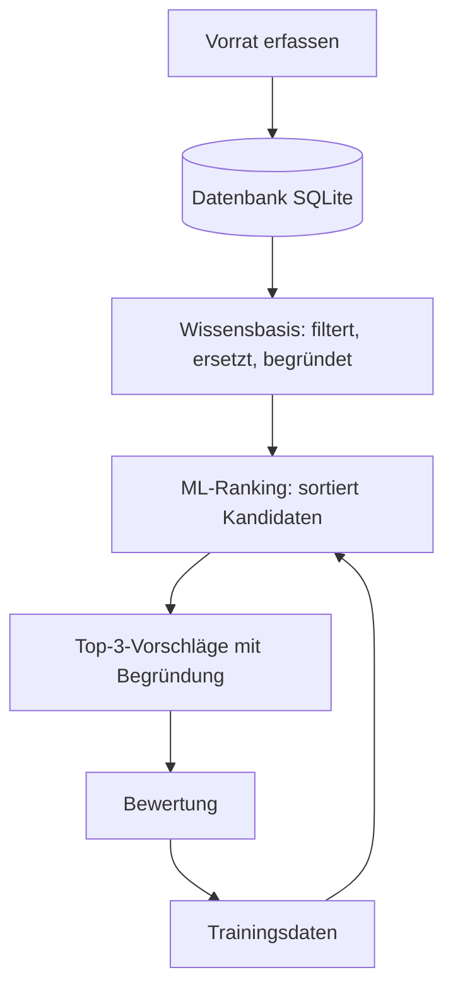

# Architektur

## Aufgabenteilung

- **Wissensbasis** entscheidet, *ob* ein Rezept in Frage kommt: Pflichtzutaten vorhanden oder ersetzbar, Einschränkungen erfüllt.
- **ML-Modell** entscheidet nur, *in welcher Reihenfolge* die geeigneten Rezepte erscheinen.

## Schnittstellen (noch festzulegen)

- Wissensbasis → ML: Liste von Rezept-IDs, je mit verwendeten Ersatzregeln und Merkmalen (Abdeckung, fehlende Pflichtzutaten, Ablaufdringlichkeit).
- ML → App: sortierte Liste von Rezept-IDs mit Score.

## Offene Entscheide

- [ ] Wissensbasis als SQLite-Tabellen oder als OWL-Ontologie (owlready2)? Mit Lehrperson klären.
- [ ] Mengenabgleich oder nur Vorhandensein prüfen?
- [ ] Bewertungen pro Person erfassen (Feld `person`)?
