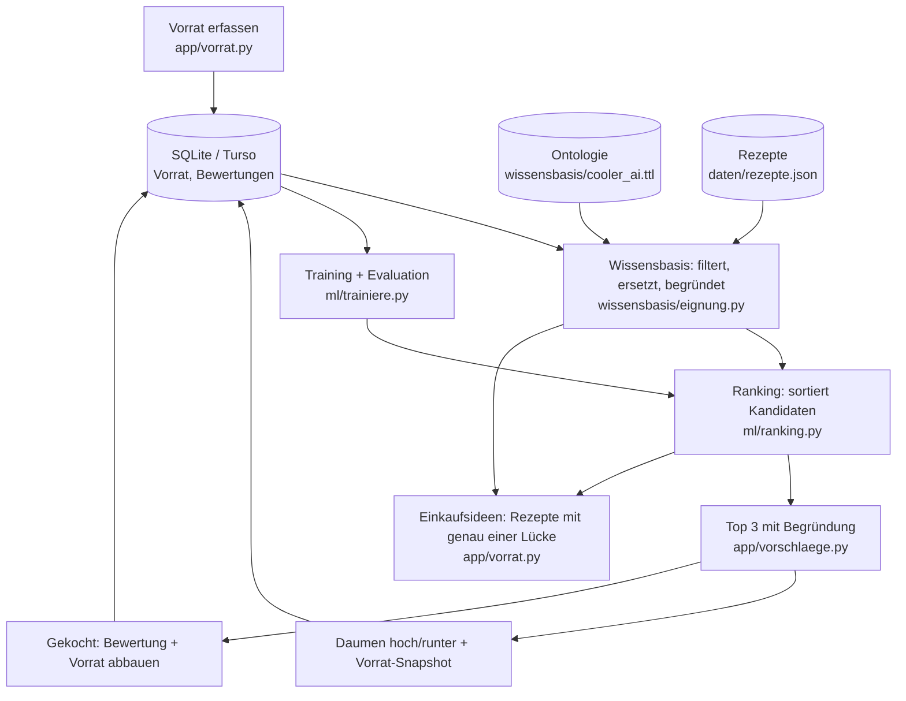

# Architektur



## Aufgabenteilung

- **Wissensbasis** entscheidet, *ob* ein Rezept in Frage kommt: Pflichtzutaten vorhanden (auch über die Hierarchie) oder ersetzbar, Filter (vegetarisch, Kochzeit) erfüllt. Sie liefert die Begründungen.
- **ML-Modell** entscheidet nur, *in welcher Reihenfolge* die geeigneten Rezepte erscheinen. Ohne trainiertes Modell sortiert eine regelbasierte Baseline.

## Schnittstellen

**Vorrat** (von `app/datenbank.py`, auch Inhalt des Snapshots):

```python
[{"id": 7, "zutat": "Cherrytomate", "menge": 250.0, "einheit": "g", "tage": 2}, ...]
# id   = Vorratseintrag (zum Entfernen nach dem Kochen; fehlt in älteren Snapshots)
# tage = Tage bis zum effektiven Ablaufdatum (None, falls unbekannt)
```

**Wissensbasis → Ranking** (`finde_kandidaten`): Liste von Prüfergebnissen

```python
{
    "rezept": {...},                      # Eintrag aus rezepte.json
    "vegetarisch": True,
    "begruendungen": ["Verwertet Spinat (läuft morgen ab).", "Crème fraîche statt Rahm: ..."],
    "fehlend_optional": ["Feta"],
    "verwendet": [{"id": 7, "zutat": "Spinat", ...}],   # Vorratsartikel, die beim Kochen aufgebraucht werden
    "dringend": ["Spinat"],                            # davon die, die bald ablaufen
    "merkmale": {"abdeckung": 1.0, "ersetzungen": 1, "fehlend_optional": 1, "dringend": 1,
                 "kochzeit_min": 15, "vegetarisch": 1, "enthaelt_Teigwaren": 1, ...},
}
```

**Ranking → App** (`sortiere`): dieselben Dicts, absteigend sortiert, mit zusätzlichem Feld `score`.

## Gekocht

Der Knopf "Gekocht" öffnet einen Dialog mit vorgeschlagenen, bearbeitbaren Verbrauchsmengen. Gespeichert werden eine Bewertung von 1–5 mit `gekocht = 1` (Snapshot = Vorrat vor dem Kochen) und der Mengenabzug (`app/datenbank.py: koche`). Restmengen bleiben erhalten. Die Rezeptauswahl prüft weiterhin nur das Vorhandensein der Zutaten.

## Einkaufsideen

Auf der Vorratsseite: "Kauf X, dann kannst du Y kochen."

1. **Wissensbasis** (`fast_geeignete` in `wissensbasis/eignung.py`): Rezepte, denen genau eine Pflichtzutat fehlt (nicht im Vorrat, nicht ersetzbar) und die mindestens einen Vorratsartikel verwenden. Die fehlende Zutat wird als frisch gekauft angenommen und die normale Eignungsprüfung läuft nochmals.
2. **ML** (`einkaufsideen` in `ml/ranking.py`): Pro möglichem Einkauf wird zusammengezählt

   ```
   Wert = Summe über freigeschaltete Rezepte von ( P(gute Bewertung) + 0.5 × geretteten dringenden Zutaten )
   ```

   Ohne Modell gilt P = 0.5 für jedes Rezept. Über die Hierarchie deckt ein Kauf auch allgemeinere Lücken ab (Vollrahm füllt auch die Lücke "Rahm").

Auch hier gilt: Die Wissensbasis entscheidet, welche Einkäufe in Frage kommen, das Modell nur die Reihenfolge.

## ML-Komponente

- **Aufgabe**: Pointwise Learning to Rank. Die logistische Regression schätzt pro Rezept und Vorratssituation die Wahrscheinlichkeit einer guten Bewertung (Note ≥ 4) und sortiert danach.
- **Merkmale**: Situation (Dringlichkeit, Abdeckung, Anzahl Ersetzungen) und Rezept (Kochzeit, enthaltene Kategorien). Die Kategorie-Merkmale kommen aus der Ontologie und erlauben es dem Modell, Vorlieben zu lernen, die keine Regel abbildet (z.B. "mag Teigwaren, mag keinen Fisch").
- **Labels**: Bewertungen aus der App (Note ≥ 4 = gut), auch die aus dem "Gekocht"-Dialog. Vorab-Rückmeldungen (Daumen hoch/runter) zählen mit Trainingsgewicht 1, Bewertungen nach dem Kochen mit Gewicht 3. Die Merkmale werden beim Training aus dem gespeicherten Vorrat-Snapshot neu berechnet.
- **Evaluation**: zeitlicher Split 80/20, Metrik Top-3-Trefferquote, immer im Vergleich zur Baseline (`python -m ml.trainiere`).

## Entscheide

- [x] Wissensbasis als OWL-Ontologie (Turtle, rdflib), getrennt von Code und Nutzerdaten. Noch mit Lehrperson bestätigen.
- [x] Rezepte als JSON-Datei, nicht in der Ontologie (Menge und Struktur passen besser in eine einfache Datei).
- [x] Nur Vorhandensein prüfen, Mengen werden gespeichert, aber noch nicht abgeglichen.
- [x] Vorrat und Bewertungen pro Person (Feld `person`). Anmeldung nur mit Namen, ohne Passwort. Das Modell lernt vorerst aus allen Bewertungen gemeinsam.
- [ ] Eigene Bewertungen reichen oder zusätzlich öffentliche Daten (Food.com Interactions)?

## Startseite und gemeinsame Ansichten

Nach der Anmeldung öffnet `app/startseite.py` die Übersicht: eigener Vorrat links, Menüvorschläge und Einkaufsideen rechts. «Vorrat anpassen» führt zur bestehenden Vorratsseite. `app/rezeptansicht.py` rendert die Menüs auf Start- und Vorschlagsseite; `app/einkauf.py` zeigt die Einkaufsideen auf Start- und Vorratsseite.

Ein Einkaufsvorschlag enthält die Menge für das bestplatzierte freigeschaltete Rezept, die übliche Einheit und ein Ablaufdatum aus der Wissensbasis. «In den Vorrat übernehmen» fügt diese Werte für die angemeldete Person hinzu und lädt die Übersicht neu. Die übrigen freigeschalteten Rezepte werden als Alternativen angezeigt; ihre Mengen werden nicht summiert.
