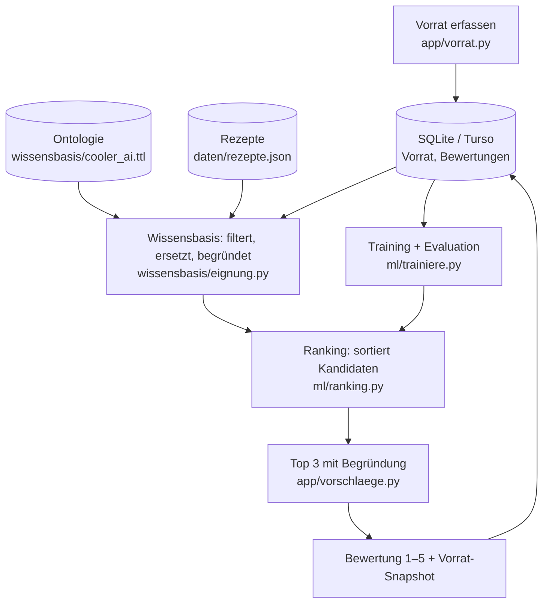

# Architektur



## Aufgabenteilung

- **Wissensbasis** entscheidet, *ob* ein Rezept in Frage kommt: Pflichtzutaten vorhanden (auch über die Hierarchie) oder ersetzbar, Filter (vegetarisch, Kochzeit) erfüllt. Sie liefert die Begründungen.
- **ML-Modell** entscheidet nur, *in welcher Reihenfolge* die geeigneten Rezepte erscheinen. Ohne trainiertes Modell sortiert eine regelbasierte Baseline.

## Schnittstellen

**Vorrat** (von `app/datenbank.py`, auch Inhalt des Snapshots):

```python
[{"zutat": "Cherrytomate", "menge": 250.0, "einheit": "g", "tage": 2}, ...]
# tage = Tage bis zum effektiven Ablaufdatum (None, falls unbekannt)
```

**Wissensbasis → Ranking** (`finde_kandidaten`): Liste von Prüfergebnissen

```python
{
    "rezept": {...},                      # Eintrag aus rezepte.json
    "vegetarisch": True,
    "begruendungen": ["Verwertet Spinat (läuft morgen ab).", "Crème fraîche statt Rahm: ..."],
    "fehlend_optional": ["Feta"],
    "merkmale": {"abdeckung": 1.0, "ersetzungen": 1, "fehlend_optional": 1, "dringend": 1,
                 "kochzeit_min": 15, "vegetarisch": 1, "enthaelt_Teigwaren": 1, ...},
}
```

**Ranking → App** (`sortiere`): dieselben Dicts, absteigend sortiert, mit zusätzlichem Feld `score`.

## ML-Komponente

- **Aufgabe**: Pointwise Learning to Rank. Die logistische Regression schätzt pro Rezept und Vorratssituation die Wahrscheinlichkeit einer guten Bewertung (Note ≥ 4) und sortiert danach.
- **Merkmale**: Situation (Dringlichkeit, Abdeckung, Anzahl Ersetzungen) und Rezept (Kochzeit, enthaltene Kategorien). Die Kategorie-Merkmale kommen aus der Ontologie und erlauben es dem Modell, Vorlieben zu lernen, die keine Regel abbildet (z.B. "mag Teigwaren, mag keinen Fisch").
- **Labels**: Bewertungen aus der App. Die Merkmale werden beim Training aus dem gespeicherten Vorrat-Snapshot neu berechnet.
- **Evaluation**: zeitlicher Split 80/20, Metrik Top-3-Trefferquote, immer im Vergleich zur Baseline (`python -m ml.trainiere`).

## Entscheide

- [x] Wissensbasis als OWL-Ontologie (Turtle, rdflib), getrennt von Code und Nutzerdaten. Noch mit Lehrperson bestätigen.
- [x] Rezepte als JSON-Datei, nicht in der Ontologie (Menge und Struktur passen besser in eine einfache Datei).
- [x] Nur Vorhandensein prüfen, Mengen werden gespeichert, aber noch nicht abgeglichen.
- [ ] Bewertungen pro Person erfassen (Feld `person`)?
- [ ] Eigene Bewertungen reichen oder zusätzlich öffentliche Daten (Food.com Interactions)?
