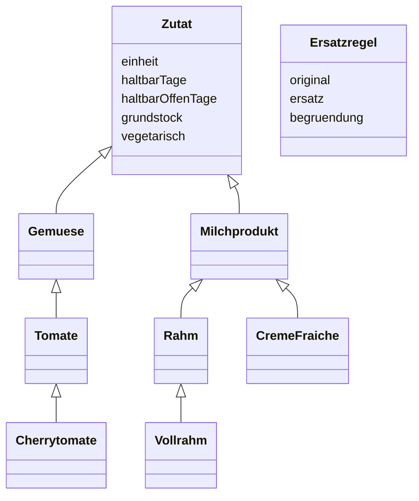
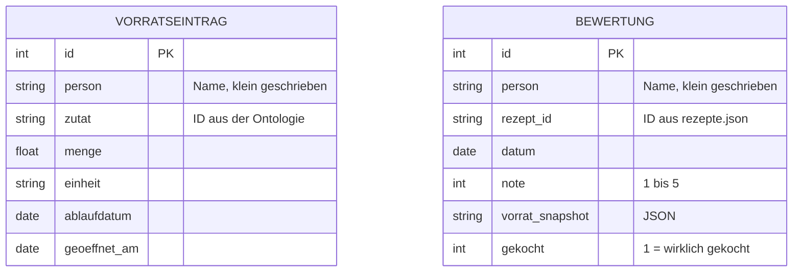

# Datenmodell

Die Daten liegen an drei Orten, je nach Art:

| Ort | Inhalt | Ändert sich |
|---|---|---|
| `wissensbasis/cooler_ai.ttl` (OWL) | Zutaten, Kategorien, Eigenschaften, Ersatzregeln | selten, per Pull Request |
| `daten/rezepte.json` | Rezepte mit Zutaten | selten, per Pull Request |
| `cooler_ai.db` (SQLite, lokal) bzw. Turso (Test/Prod) | Vorrat, Bewertungen | laufend, wird nicht eingecheckt |

Verbunden sind sie über die **Zutat-ID** (lokaler Name der OWL-Klasse, z.B. `Cherrytomate`) und die **Rezept-ID** (z.B. `spaghetti_carbonara`).

## Ontologie



Ausschnitt; vollständig in `wissensbasis/cooler_ai.ttl`, Erklärung in `docs/wissensbasis.md`.

## Rezepte (`daten/rezepte.json`)

```json
{
  "id": "spaghetti_carbonara", "titel": "Spaghetti Carbonara", "kochzeit_min": 20, "portionen": 2,
  "zutaten": [
    {"zutat": "Spaghetti", "menge": 200, "einheit": "g", "pflicht": true},
    {"zutat": "Pfeffer", "menge": null, "einheit": null, "pflicht": true}
  ]
}
```

`zutat` darf auch eine Kategorie sein (`Teigwaren`), dann passt jede Unterart. `vegetarisch` wird nicht eingetragen, sondern aus der Ontologie abgeleitet.

## SQLite

Lokal eine Datei `cooler_ai.db`, in der Test- und Produktionsumgebung eine Turso-Datenbank (SQLite in der Cloud, gleiches Schema). Siehe `docs/deployment.md`.



## Hinweise

- **`person`**: Beim Öffnen der App gibt man seinen Namen ein (kein Passwort). Jede Person sieht nur ihren eigenen Vorrat. Bestehende Datenbanken bekommen die Spalte beim Start automatisch (`_ergaenze_spalte`); alte Einträge ohne Person sieht niemand mehr.

- **Effektives Ablaufdatum** = früheres von Etikett und Öffnungsdatum + `haltbarOffenTage` (`Wissensbasis.effektives_ablaufdatum`).
- **`BEWERTUNG.vorrat_snapshot`** speichert den Vorrat zum Zeitpunkt der Bewertung als JSON (Zutat, Menge, Einheit, Tage bis Ablauf). Ohne ihn lassen sich die Trainingsmerkmale nicht rekonstruieren.
- **`BEWERTUNG.gekocht`** kam nachträglich dazu. `verbinde()` ergänzt die Spalte in bestehenden Datenbanken (Turso Test/Prod) automatisch.
- **Vorab-Rückmeldung**: Daumen hoch wird als `note = 5`, Daumen runter als `note = 1`, jeweils mit `gekocht = 0` gespeichert. Die Werte dienen als positive/negative Labels; die Oberfläche zeigt keine Zahlenskala. Bestehende Vorab-Bewertungen bleiben verwendbar.
- **Trainingsgewicht**: Vorab-Rückmeldungen zählen mit Gewicht 1, die 1–5-Bewertungen nach dem Kochen mit Gewicht 3. Der Snapshot und die übrigen Spalten bleiben unverändert; es ist keine neue Migration nötig.
- Wird eine Zutat aus der Ontologie gelöscht, bleiben alte Vorratseinträge mit dieser ID stehen. Zutaten deshalb lieber umbenennen (`rdfs:label`) als die ID ändern.
