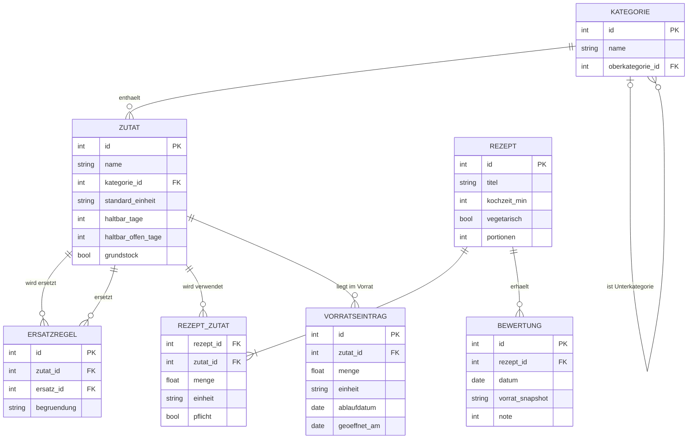

# Datenmodell

## Hinweise

- `KATEGORIE` verweist auf sich selbst und bildet so die Hierarchie (Cherrytomate → Tomate → Gemüse).
- `REZEPT_ZUTAT.pflicht` trennt Pflicht- von optionalen Zutaten.
- `BEWERTUNG.vorrat_snapshot` speichert den Vorrat zum Zeitpunkt der Bewertung als JSON. Ohne diesen Snapshot lassen sich die Trainingsdaten nicht rekonstruieren.
